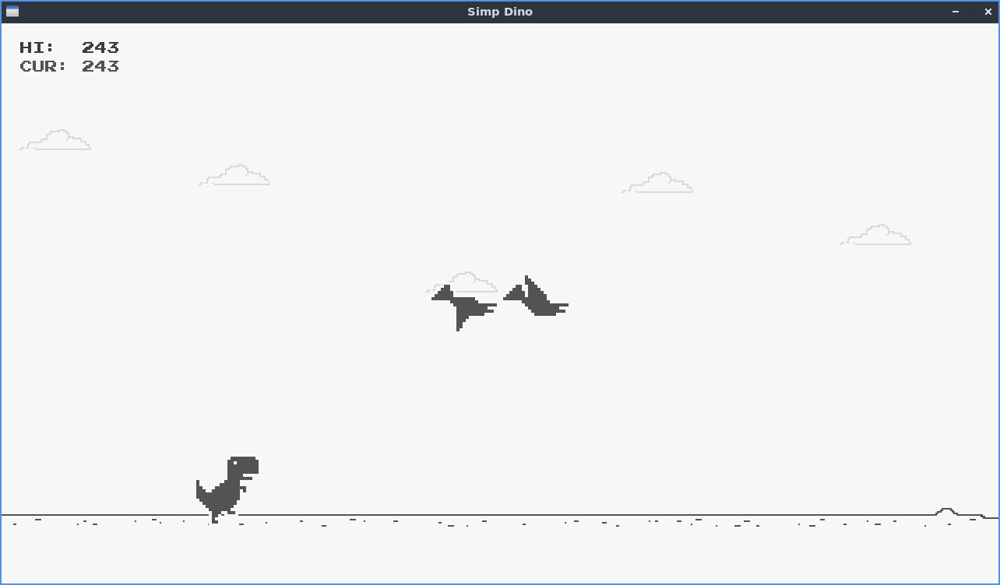

# Simp Dino

A WIP Google T-Rex clone written in C using Simp Engine

## Building

Simp Dino is written in C and can be compiled with the C compiler of your choice. In order to compile properly it it must be linked against SDL2, SDL2_ttf and SDL2_image.

Running this command should work on most systems:

`$ cc src/*.c src/simp_engine/src/simp.c -Ofast -lSDL2{,_ttf,_image} -o SimpDino`{:.bash}

The resulting binary can then be run either by double-clicking its icon in a file manager, or by running the following command:

`$ ./SimpDino`{:.bash}

## License

Simp Dino is licensed under the MIT license which can be found [here](LICENSE)
